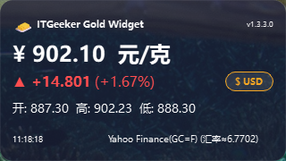

<div align="center">

# 🧈 ITGeeker Gold Widget

一款轻量的 Windows 10 / 11 桌面黄金价格小组件，使用 Python 与 PySide6 编写。

<br>

<!-- CI 徽章预留位：未来接入持续集成后在此处插入构建状态徽章 -->


<br>

[Gitee仓库主页](https://gitee.com/itgeeker/itgeeker_gold_widget) · [Github仓库主页](https://github.com/alanljj/itgeeker_gold_widget) · [问题反馈](https://gitee.com/itgeeker/itgeeker_gold_widget/issues) · [ITGeeker主页](https://www.itgeeker.net)

</div>

---

## 项目简介

**ITGeeker Gold Widget** 是一款开源的桌面黄金价格小组件。它把沪金 Au9999 与国际金价浓缩成一个小巧的桌面浮窗，常驻屏幕一角，让你不用反复打开浏览器或行情 App，也能随时瞥一眼当前金价、涨跌与行情来源。

小组件默认显示**人民币 / 克（Au9999 沪金）**的实时行情，也支持一键切换到**美元 / 盎司**观察国际金价。所有偏好（窗口位置、配色、刷新频率、货币单位、是否开机自启等）都会自动保存，下次启动时按习惯恢复。界面基于 PySide6 构建，外观是无边框、透明、可拖动、可调整大小的悬浮卡片，并提供完整的系统托盘菜单，方便隐藏、刷新、置顶或退出。

> ⚠️ **数据来源声明**：界面展示的行情来自第三方公开接口（新浪财经、GoldPrice.org、Yahoo Finance），可能受网络状态与接口限制影响，**仅作日常观察参考，不构成任何投资建议**。

---

## 核心特性

- 💱 **双币种一键切换**：内置「人民币 / 克（CNY）」与「美元 / 盎司（USD）」两种行情模式，按钮即点即换。
- 📈 **完整行情视图**：同屏展示当前价、涨跌额、涨跌幅、开盘价、最高价、最低价与上一次收盘价。
- 🔁 **三级数据源自动回退**：CNY 模式按「新浪 Au9999 → GoldPrice.org → Yahoo Finance（汇率换算）」依次尝试；USD 模式按「Yahoo GC=F → GoldPrice.org」依次尝试。
- ⏱️ **可调刷新频率**：在设置对话框内调整刷新间隔，范围 10 秒到 1 小时（默认 60 秒）。
- 🪟 **无边框透明浮窗**：圆角玻璃质感，支持鼠标拖动移动，右下角拖拽调整大小，可选窗口置顶。
- 🎨 **可视化自定义**：自定义背景色、背景透明度（30~255）、文字颜色与字体大小（8~32 px）。
- 🖥️ **系统托盘常驻**：托盘图标双击显示 / 隐藏窗口，右键菜单提供刷新、置顶、设置、官网、版本、退出等操作。
- 💾 **配置自动持久化**：所有偏好写入本地 JSON，下次启动自动恢复窗口位置、大小与外观。
- 🚀 **Windows 开机自启**：一键写入 `HKCU\Software\Microsoft\Windows\CurrentVersion\Run`，随系统后台常驻。

---

## 效果演示

<div align="center">
  
  <br>
  <sub>桌面一角的金价浮窗，支持拖动、置顶与个性化配色</sub>
</div>

---

## 快速上手

### 环境准备

- **操作系统**：Windows 10 或 Windows 11
- **Python**：3.14 或更高版本（参考 `pyproject.toml` 的 `requires-python`）
- **依赖库**：PySide6（>= 6.11.1）、requests（>= 2.34.2）
- **网络**：首次运行需要联网以拉取金价行情

> 如果你的本地 Python 版本低于 3.14，建议通过官方安装包升级后再继续。

### 安装步骤

以下命令在 **Windows PowerShell** 中执行即可，开箱即用：

```powershell
# 1. 克隆仓库
git clone https://gitee.com/itgeeker/itgeeker_gold_widget.git

# 2. 进入项目目录
cd itgeeker_gold_widget

# 3. 创建并激活虚拟环境
python -m venv .venv
.\.venv\Scripts\Activate.ps1

# 4. 安装依赖
python -m pip install -r requirements.txt
```

### 使用示例

启动桌面小组件：

```powershell
# 在已激活的虚拟环境中执行
python main.py
```

启动后，桌面上会出现一个半透明浮窗。常见交互：

- **左键拖动**：移动浮窗到任意位置
- **右下角拖拽**：调整浮窗大小
- **右键菜单**：刷新、设置、置顶、退出
- **双击托盘图标**：显示或隐藏浮窗
- **货币切换按钮**：在 CNY 与 USD 之间切换

需要打包成独立 EXE 时：

```powershell
python -m pip install pyinstaller
python -m PyInstaller itgeeker_gold_widget.spec --clean --noconfirm
```

`itgeeker_gold_widget.spec` 中将 `COLLECT` 的 `name` 设为空字符串，构建产物与所有依赖文件会落在项目根目录（与 spec 文件同级），而非默认的 `dist/` 子目录。

---

## 配置说明

首次运行时，程序会在用户目录下创建配置文件：

```text
%USERPROFILE%\itgeeker_widget_config\config_gold.json
```

所有可调参数均可在 **设置对话框**（右键菜单 → 设置）中修改并即时保存，无需手动编辑 JSON。下表列出了当前实现的全部用户级字段及其默认值：

| 字段 | 默认值 | 取值范围 / 说明 |
|------|--------|-----------------|
| `window_x` | `100` | 浮窗左上角 X 坐标（像素） |
| `window_y` | `100` | 浮窗左上角 Y 坐标（像素） |
| `window_width` | `320` | 浮窗宽度（像素，最小 210） |
| `window_height` | `180` | 浮窗高度（像素，最小 135） |
| `always_on_top` | `false` | 是否始终置顶 |
| `bg_color` | `#1a1a2e` | 背景颜色（HEX） |
| `bg_opacity` | `220` | 背景透明度（30~255） |
| `font_size` | `14` | 正文字号（8~32 px） |
| `text_color` | `#ffffff` | 文字颜色（HEX） |
| `refresh_interval` | `60` | 数据刷新间隔（10~3600 秒） |
| `currency` | `CNY` | 价格单位：`CNY` 或 `USD` |
| `auto_start` | `false` | 是否随 Windows 开机自启 |

> 🛠️ **推荐做法**：优先使用设置对话框修改配置。手动编辑 JSON 仅在排查问题时使用，并且注意保留合法的 JSON 语法（UTF-8 编码）。

---

## 贡献指南

欢迎通过 Issue 与 Pull Request 一起把这个小组件做得更好。流程很简单：

1. **Fork** 仓库到你的 Gitee 账号下
2. 基于 `main` 分支创建一个特性分支，例如 `feat/awesome-improvement`
3. 在分支上提交改动，建议保持提交粒度小、描述清晰
4. 推送到你的 Fork：`git push origin feat/awesome-improvement`
5. 在 [Gitee 仓库](https://gitee.com/itgeeker/itgeeker_gold_widget)发起 **Pull Request**，并在说明中写清楚改动动机与验证方式

---

## 开源协议

> **木兰宽松许可证，第 2 版（**Mulan Permissive Software License, Version 2, Mulan PSL v2**）**
> 2020 年 1 月：http://license.coscl.org.cn/MulanPSL2
---

<div align="center">

由 **技术奇客 ITGeeker.net** 用心维护 ·
若觉得这个小工具对你有帮助，欢迎点亮 Star ⭐

</div>
